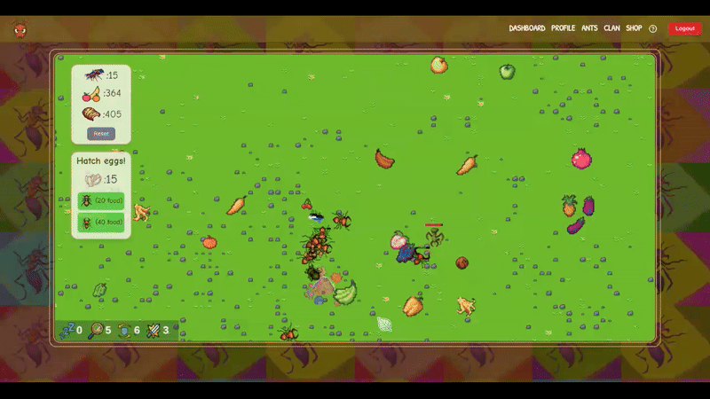
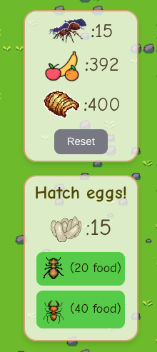
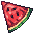
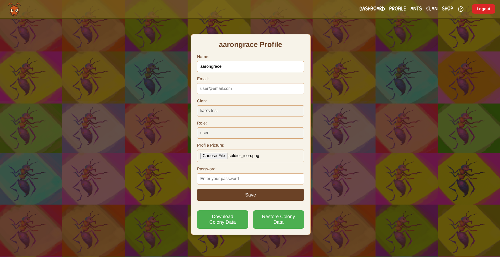
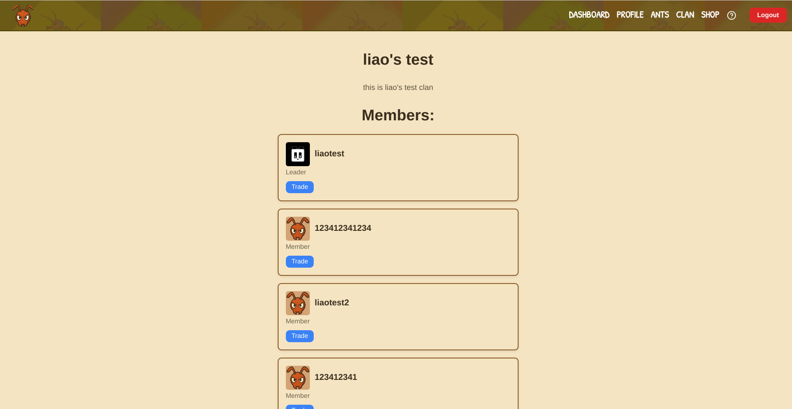
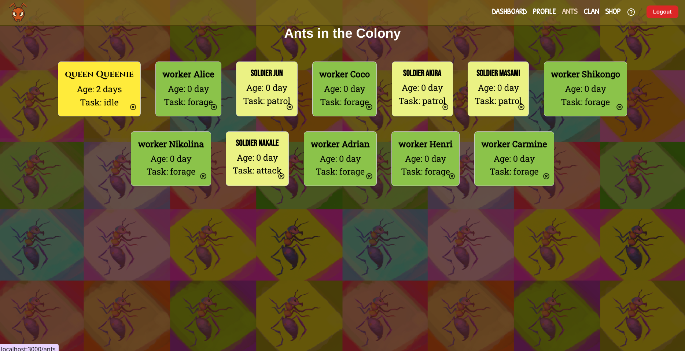
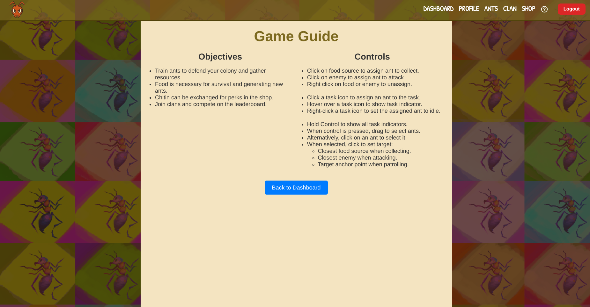
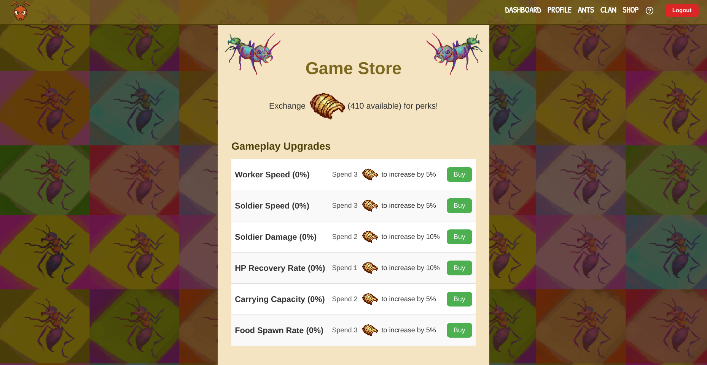

# Clash of Colonies

Ants are fascinating species with a complex social organization, making them an ideal subject for a simulation game that is both entertaining and educational. This project aims to create a web-based solution that effectively simulates ant colonies, focusing on reproduction, resource gathering, and colony expansion. 

Players will manage their own colonies, join clans, and trade resources within a React-powered frontend. The backend, built with FastAPI, ensures persistence and multiplayer features using MongoDB



# Descriptions and Implementations of Major Systems

## Core Game Display and Mechanics

### Canvas
The entire visual output of Clash of Colonies is rendered onto a HTML5 `<canvas>` element.

**Time Management and Animation Loop:**

The `Canvas` component meticulously tracks the passage of time using React refs (`lastFrameTime`). This reference is updated in each frame of the animation.

* **Efficient Animation:** `requestAnimationFrame` is used to call the `animate` function. This browser API synchronizes rendering with the browser's refresh rate (typically 60fps), leading to fluid visuals. Critically, it **pauses automatically** when the browser tab or window is not active, significantly reducing CPU and battery consumption.

**`animate` Function:**

1.  **Display**: calls the draw function of each game object 
2.  **Update:** It calculates the elapsed time (`delta`) since the last frame and calls the update functions 

***Update Functions***

  **`continuousUpdate`**
  - **`handleScrolling(delta)`:** Adjusts the visible map area based on user scroll input and speed, respecting map boundaries.
  - **`updateAnt(delta)`:** Changes ant positions and animations over time; updates enemy behaviors.

  **`discreteUpdate`**
  - Runs at a set interval to update:
    - Ant tasks and logic.
    - Enemy behaviors.
    - Colony resource consumption and health restoration.
    - Egg laying and colony reproduction.
    - Map entity cleanup and spawning.
    - Seasonal changes and colony age progression.
    - Game-over conditions if all ants are dead.

  **`synchronization`**

  - Periodically updates the colony state to the backend if the time since the last sync exceeds `vars.update.syncInterval`. The `putColonyInfo` function handles the update, and `lastSyncedTime.current` prevents redundant requests.

### Dashboard UI
Aside from the canvas, the dashboard includes:

- **Information Panel**: Displays critical colony statistics such as food, sand, and ant count. It also provides options like resetting the colony to its initial state.
- **Reproduction Panel**: Allows players to create new ants by spending resources like food and eggs, provided the necessary conditions are met.

These panels are implemented as React components and are superimposed on the canvas




#### Seasonal Cursor Updates
- When hovering over the canvas or the dashboard panels, the cursor is dynamically linked to a specific season and updates automatically as the seasons change.
  
   

### Background Map

#### Map Initialization

- **`initializeMap`**: Sets up the map by populating `GameMap.tilesGrid` with tile types based on random factors.
- Rock clusters are generated using a distance-based algorithm to ensure natural distribution. Otherwise, they would appear very uniform and unnatural


The tileset for the game.

#### Map Storage and Seasonal Adjustment

The map is stored in the database as a matrix structured as `[rows[cols[[tile_row, tile_col]]]]`. To account for seasonal variations, the season index (`0` for spring, `1` for summer, `2` for autumn, `3` for winter) is multiplied by `rowsPerSeason` and added to the `tile_row`, to get the row for the current season.
- From the matrix, the full map image data is generated by translating the tile index to tile pixels and stored in `GameMap.imageData`, which is then cropped to generate the viewport-specific map data -- `GameMap.partialImageData`.


#### Tile Updates

The `updateTiles` function is responsible for iterating through `GameMap.tilesGrid` and updating each tile based on specific rules:

1. **Normal Tiles**:
     - Have a chance to transform into grass.

2. **Grass Tiles**:
     - Progress through growth stages:
       - Grass (Stage 1) → Grass (Stage 2) → Grass (Stage 3).

3. **Grass (Stage 3)**:
     - Have a chance to sprout.

4. **Sprouting Tiles**:
     - Progress through their lifecycle and eventually become fruit.

      - Seasonal growth and death rates influence tile transitions (e.g., grass growing or dying, sprouting fruit).


How grass tiles sprout into fruits. Note that fruits decay over time

#### Seasonal Effects

- Growth and death rates for grass and sprouts are determined by `seasonalGrassGrowChances` and `seasonalGrassDeathChances`, which vary by season.
- Seasonal modifiers affect the probability of grass growth (`seasonalGrassGrowthModifiers`), with higher growth rates in spring and lower rates in winter.

### Ant Rendering and Mechanics

#### Class Definition

- **Ant Class**: Stores all crucial data for the rendering and behaviors of the ants. Also contains methods primarily relating to graphic rendering of the ants.

- **Ant Data**: Represents the raw state of an ant, used for syncing with the backend and backups. Does not include any display specific information such a angle and spriteFrame.
  - By separating frontend-specific logic from the core data, the `Ant` class ensures smooth synchronization with the backend and backups while reducing data transfer overhead by only syncing essential fields.

#### Ant Display
- **Positioning**: The ant's position is calculated relative to the viewport, ensuring it is drawn in the correct location on the canvas.
- **Rotation**: The ant's angle is set based on its movement direction, and the canvas is rotated accordingly.
- **Sprite Animation**:
  - Different sprites are used based on the ant's type and task.
  - Each ant tracks its own sprite timer, which is updated with the animation frames of the game
  - Frame updates are managed by `updateSpriteFrame`, cycling through frames for smooth animations.
- **Task Indicators**:
  - Visual cues like patrol circles, attack arrows, or forage arrows are drawn based on the ant's current task.
- **Health Bar**: A health bar is displayed above the ant if its health is below the default value.
- **Carried Entity**: If the ant is carrying an item, it is drawn above the ant with scaling based on the item's size.
- **Selection Highlight**: A circle is drawn around the ant when it is selected, providing visual feedback to the user.

#### Ant Logic

##### Foraging
Ants tasked with foraging will seek out the nearest resource, prioritizing food or chitin based on their current load. If carrying resources, they return to the gateway to deposit them. Upon reaching a resource, they collect it incrementally until full or the resource is depleted. If no resources are found, they hover near the gateway.

##### Attacking
Ants assigned to attack will locate and pursue enemies within range. Upon reaching an enemy, they engage in combat. If no enemies are found or the target is lost, soldier ants begin patrolling, while other types return to idle behavior.

##### Patrolling
Patrolling ants move between designated points, scanning for nearby enemies. If an enemy is detected, they switch to attack mode. When reaching a patrol point, they randomly select a new destination within their patrol range.

### Enemy Rendering and Mechanics
The enemies are implemented similarly to the ants but with significantly simpler logic. They pursue the nearest ant and attack it when in range

### Map Entities

Map entities represent interactive elements on the game map, such as gateways, food resources, and chitin sources. These entities are displayed dynamically on the canvas using preloaded images.

#### Rendering and Interaction

- **Rendering**: Each entity is drawn on the canvas using its associated image. If the entity is hovered over, a highlighted version of the image (if available) is displayed.
- **Dynamic Sizing**: The size of the entity is determined by its `width` and `height` properties, ensuring accurate scaling on the map.
- **Click Handling**: Entities can respond to user clicks. For example, right-clicking a food resource triggers ant interactions, such as assigning or removing ants from the resource.

#### Fruit

Fruits are a specialized type of map entity, inheriting from `MapEntity`. They are defined by their position (`row` and `col`) on a sprite sheet and progress through stages based on their remaining amount. Key features include:

#### EnemyCorpse
Enemy corpses are a unique type of map entity that represent the remains of defeated enemies. They serve as a source of chitin, which can be harvested by ants.
  - Is displayed as chitin when carried by an ant
  - Has a decay animation that progresses based 


## Users/Profile

Profiles contain information about each user as well as the ability to 
- update their profile information (including profile picture)

- download / upload any backups they've made of their colony



## Clans

Clans allow users to trade resources amongst other members within their clan. If a user is not in a clan, all clans will be listed and they can choose to join one. Clans bring in several levels of users including "members" and "leaders".

Leaders have the ability to kick members in their clan.


## Trades

Trades simply move resources from one user to another and are initiated by a member within a clan. Once initiated the outgoing request is marked as pending and is displayed to the receipient who can then choose to accept / deny the trade request.

## Ants
The basic information of each ant is displayed in the ants page. Each can be removed by clicking the x on top right


## Guide
A basic game guide can be accessed by clicking on the ? icon on the navbar.


## Admin Functions
The admin page provides a suite of tools for managing user accounts and colonies. This page is accessible only to users with the "admin" role. The available features include:

  - **Delete Profile**: Permanently removes a user's profile from the system.
  - **Change Role**: Updates a user's role to one of the following:
    - `admin`: Grants administrative privileges.
    - `user`: Assigns standard user permissions.
    - `banned`: Restricts access to the game.
  - **View Profile Information**: Displays detailed information about a user's profile, including their username, email, and role.
  - **View Colony Data**: Retrieves and displays information about the colony associated with a user's profile, such as the number of ants, resources, and colony age.
  - **Modify Colony Resources**:
    - Adjust the amount of specific resources (e.g., food, eggs, chitin) held by a colony.
    - Supported operations include setting a value (`=`), adding (`+`), or subtracting (`-`) a specified amount.
  - **View Pending Trades**: Lists all pending trade requests associated with a user's profile, allowing admins to monitor resource exchanges within clans.

## Navigation
A navigation bar takes the user to the different pages. It dynamically adjusts based on the user's role, ensuring that only admins can see the admin page

## Shop

The shop allows players to exchange chitin, a key in-game resource, for various upgrades and cosmetic items. 


### Gameplay Upgrades
Players can enhance colony performance by purchasing upgrades, such as boosting worker ant speed or improving resource collection. Each upgrade is an instance of the `Upgrade` class, which dynamically tracks its cost and effect based on the number of times it has been purchased (`timesUpgraded`). Costs scale exponentially using the formula: `base_cost * 1.7^timesUpgraded`.

### Cosmetic Upgrades
Not yet implemented


# Backend Setup

The backend is built with **FastAPI**, which handles all routes and business logic.

## FastAPI Router
- Routes requests from the frontend to the backend.
- Different routers are set up for:
  - Colonies
  - Profiles
  - Clans
  - Trades

---

## MongoDB Database

The database consists of four collections:

1. **User Collection**:
   - Fields: `id`, `name`, `region`, `clan`, `images`, `createdDate`, `password`, `email`, `role`.

2. **Colony Collection**:
  - Fields: `id`, `name`, `ants`, `mapEntities`, `enemies`, `fruits`, `eggs`, `food`, `chitin`, `age`, `map`, `perks`, `initialized`.

3. **Trades Collection**:
  - Fields: `id`, `from_user_id`, `to_user_id`, `offer_resource`, `offer_amount`, `request_resource`, `request_amount`, `status`, `created_at`

4. **Clan Collection**:
   - Fields: `users` (separated into leader/officer/member), `clan score`.

---

### Backend Tests
To run the backend tests, use the following command in the root folder:

```bash
pytest
```

#### `test_register_success`

Verifies successful user registration using `monkeypatch`

  - Mocked `Profile` and `Colony` models.
  - Dependencies like `httpx.AsyncClient` for HTTP requests and `pytest` for testing.
  - Send POST request to `/profiles/register` with test data.
  - Assert status code `200` and success message.

#### `test_update_role_to_admin`

Ensures a user's role can be updated to "admin" using mock dependency injection

  - Mock profile with initial role as "user."
  - Override `fetch_profile_by_username` to return the mock profile.
  - Send PUT request to `/profiles/update-role/testuser` with role "admin."
  - Assert status code `200` and verify updated role.

#### `test_root`
Verifies the root endpoint returns the expected greeting message.


### Backend Logging

The backend utilizes Python's `logging` module to provide robust logging functionality. 
All essential router operations are logged in the `app.log` file located in the root directory of the backend. 


## Development Notes

The conversion between camel case and snake case is NOT automatic when sending data between frontend and backend. Please only use camel case for all class fields relating to backend data such as tasks or units!!! Mismatches in field names will result in **422 Unprocessable Entity** when sending objects.

### npm Modules

If you want to install a npm module for the frontend, you need to cd to the frontend folder and install it there with npm install .... The npm package.json and node modules in the root folder are only used for concurrently and installing packages there might confuse VSCode into thinking that certain modules are enabled for the frontend when they are not.

---

## Versions

### 2.0
- The whole project has been completely refactored such that all game behavior-related functions are relegated to the backend.
- Instead of creating new units and sending them to the backend, the new approach is to have the frontend send a message to advance the time cycle to the main router, which then deals with the logic.
- This is so that Unit objects would not be passed back and forth between the frontend and the backend, which causes endless headaches with Pydantic, as the frontend class declarations do not clearly line up with those from the backend. Deserialization and serialization work extremely poorly when dealing with abstract classes and inheritance, as Pydantic requires precision.

### 3.0
- Refactored the `Colony` model:
  - The `id` field now matches the `userId` and serves as the unique identifier for colonies.
  - All fields in the `Colony` model are now camel case.
  - Added an `initialize_default` method to create a default colony with 5 ants, 100 food, and 100 sand.
- Updated the backend to reflect the changes in the `Colony` model.
- Improved consistency between frontend and backend models by enforcing camel case across all fields.
- Added new features to the **Clan View**, **Admin View**, and **Store View**.

### 4.0
- Fully implemented clans, trades, admin features
- Added original art assets
- Added game map, enemies and chitin resource
- Added shop

